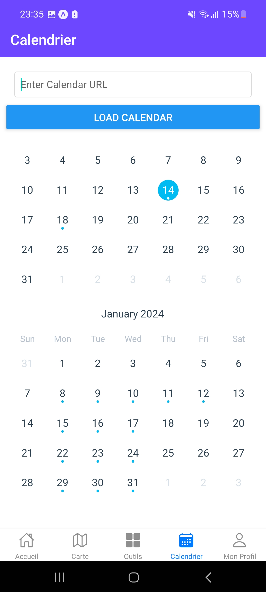
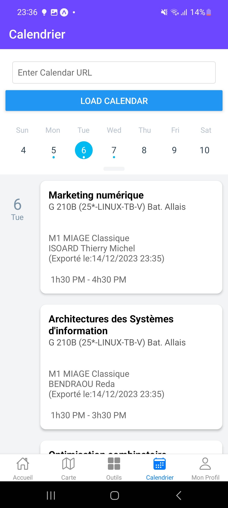
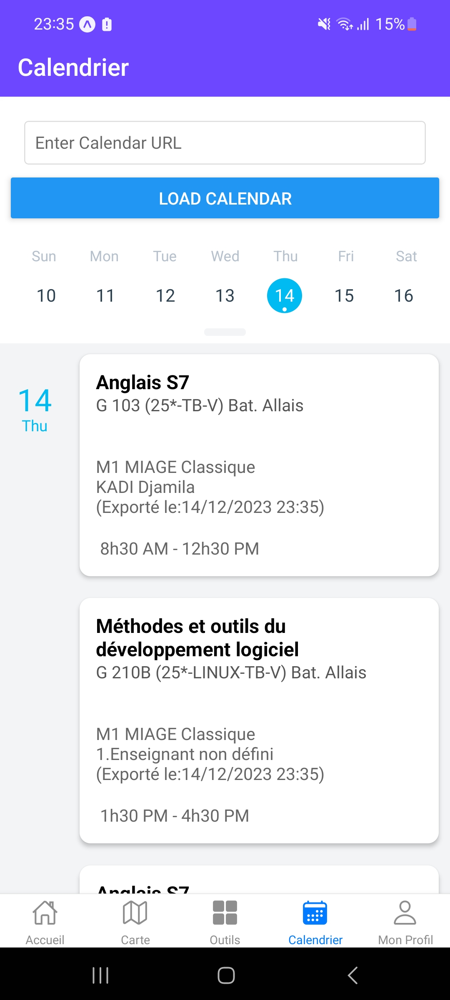
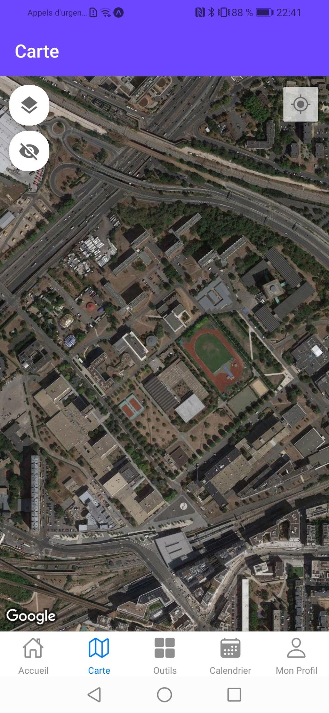
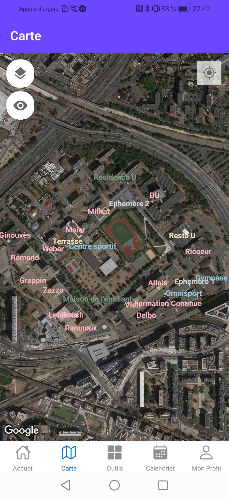
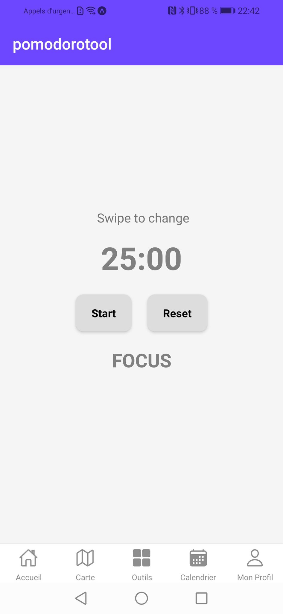
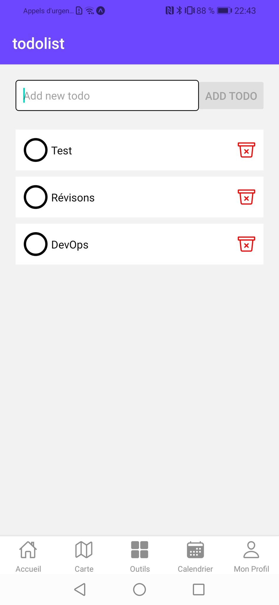

// lancer "asciidoctor-web-pdf ./doc/doc.adoc" pour générer le pdf

= Projet MonUPN

== Partie 1: Synthèse

=== Titre du Projet, Abréviation, Logo
Titre du Projet:: MonUPN - Mon Université Paris Nanterre
Abréviation:: MonUPN
Logo::
[.text-center]

=== Membres de l'Équipe
- Tayeb Mohammedi
- Ludjie Alnatas
- Anaëlle Goncalves

=== Présentation
Contexte:: Le projet MonUPN a été initié pour répondre aux besoins des étudiants de l’Université Paris Nanterre, cherchant à simplifier leur
vie quotidienne sur le campus grâce à une application mobile facile d’utilisation
Problématique et Gain Attendu::
- Créer une plateforme tout-en-un pour les services étudiants.
- Améliorer la communication et l’interaction au sein de la communauté universitaire.
- Offrir une expérience utilisateur intuitive et personnalisée.
Motivation de l'Équipe:: Simplifier la vie des étudiants et répondre à leurs besoins.
Concurrence / État de l'Art:: Distinction par une combinaison unique de fonctionnalités.

=== Concurrents
**MyNanterre**

  - Programmation de séances de sports.
  - Visualisation de l'affluence dans les cafétérias.
  - Accès aux horaires de trains.

**UnivMobil** (plus maintenue)

  - Géolocalisation sur les campus.

**Imagina** (pas utilisée par Nanterre)

  - Emploi du temps.
  - Dématérialisation des notes et de la carte étudiant.
  - Partage d'information et prise de notes.

=== Personas et Fonctionnalités
Personas::
**Étudiant**
  - Accès à la carte du campus.
  - Consultation de l'emploi du temps.
  - Utilisation de la map pour repérer les bâtiments, restaurants, BU.
  - Outils tels que Todo, Chat, Pomodoro, etc.
  - Consultation des bons plans autour du campus.
  - Accès aux informations sur les événements associatifs.

**Business**

  - Publication de bons plans.

=== Prévisions Marketing
Stratégies:: Utilisation des réseaux sociaux, partenariats avec les associations, campagnes ciblées.

== Partie 2: Aspects Techniques

=== Type d'Application
- Mobile (React Native)

=== Plateforme Technologique
Langages Utilisés:: TypeScript et JavaScript (React Native)
Frameworks de Test:: Jest
Lien Métier/API:: Firebase
Métier/Persistance:: Firebase (Cloud Firestore)

=== Plateforme Opérationnelle
Gestion de Versions:: Git, GitHub
Build:: Expo Application Services (EAS)
Qualité de Code:: SonarCloud
CI/CD:: GitHub Actions

=== Interconnexion avec Systèmes / API Distantes
[Description des systèmes ou API avec lesquels une interconnexion est prévue]
- Intégration Google Maps API pour la carte du campus.
- Lien ICS pour l'emploi du temps.
- Scraper Instagram pour afficher les événements associatifs.
- API dédiée pour le chat.
- API dédiée pour le forum.

=== Acquisition de Données et Usage Intelligent
Stratégies d'acquisition de données:: Utilisation de Firebase.
Usage Intelligent Prévu::
- Analyse des Matières : Exploration des matières de l'emploi du temps pour comprendre les priorités académiques.
- Analyse des Chapitres : Identification des chapitres étudiés à l'aide de l'outil Pomodoro.
- Recommandation Vidéos : Propose des vidéos en lien avec les chapitres étudiés pour enrichir la compréhension.
- Notifications Stratégiques : Suggestions de pauses ou de changements d'activités basées sur les habitudes d'étude.
- Rapports Hebdomadaires : Réception de rapports hebdomadaires détaillant le temps consacré à chaque matière.
- Tâches Adaptées : Réception de tâches à faire personnalisées selon les préférences et habitudes de l'utilisateur.
- Interactions Sociales : Analyse des interactions sociales sur le forum pour suggérer des groupes d'étude ou des événements pertinents.
- Historique d'Événements : Collecte de l'historique d'événements fréquentés pour recommander des activités culturelles similaires.
- Activités sur la Carte : Enregistrement des endroits fréquemment visités pour personnaliser les recommandations de lieux sur la carte du campus.

<<<
== Partie 3: Fonctionnalités actuelles du Projet (Version 0.4)
== Calendrier

Importez votre emploi du temps depuis un lien iCalendar (ICS) pour afficher les événements avec détails tels que le nom, le lieu, la description et l'heure.

<<<
== Carte avec Marqueurs

Visualisez une carte avec des marqueurs pour les bâtiments, restaurants et la BU. Choisissez d'afficher ou de masquer chaque type de marqueur.

 

<<<
== Pomodoro

Choisissez entre deux modes de Pomodoro : 25/5 ou 50/10.

[.text-center]

<<<
== Todolist

Créez et gérez votre liste de tâches. Supprimez les tâches une fois accomplies.

[.text-center]

<<<
== Partie 4: Fonctionnalités Futures (Version 1.0)

=== Chat

Intégrez un système de chat pour faciliter la communication entre les étudiants. Créez des salons de discussion pour des matières spécifiques, des projets de groupe ou des événements.

=== Profil Business

Mettez en place un profil Business pour permettre aux entreprises partenaires locaux et associations de partager des bons plans ou des évènements avec la communauté étudiante. Cela pourrait inclure des offres spéciales, des réductions et des promotions exclusives.

=== Amélioration de la Todolist

Offrez la possibilité de créer des dossiers pour organiser et structurer les tâches au sein de la Todolist. Cette fonctionnalité permettra aux étudiants de mieux gérer et hiérarchiser leurs responsabilités.

=== Statistiques d'Utilisation

Intégrez une fonctionnalité de statistiques d'utilisation pour que les utilisateurs puissent suivre leur activité sur l'application, y compris le temps passé sur chaque fonctionnalité, les objectifs Pomodoro atteints et les tâches accomplies.

== Conclusion

Le projet MonUPN vise à continuellement évoluer pour répondre aux besoins changeants des étudiants de l'Université Paris Nanterre. Ces fonctionnalités futures sont conçues pour améliorer l'expérience utilisateur et rendre l'application encore plus indispensable dans la vie quotidienne des étudiants.

=== Lien Youtube
https://youtu.be/yZpX_i_XdBo

=== Lien Github
https://github.com/anagclvs/MonUPN.git